# Egress Proxy and credential lifecycle

- **ID:** RFC-0019
- **Created:** 2026-10-06
- **Updated:** 2026-10-10
- **RFC PR:** [#1530](https://github.com/openclaw/openclaw-enterprise/pull/1530)

## Problem and proposal

Agents need provider access without receiving credentials, and OCE needs replaceable egress. Today `CredentialGatewayDriver` combines source management with attachments. The [static credential workflow](../../../docs/reference/credential-sources.md#update-a-source) copies values into the gateway, so a Secret change requires a source update and redeployment.

Retire that Driver and introduce `EgressProxyDriver`; retain `SandboxDriver` networking and evolve `SecretDriver` and `CredentialRefreshDriver`. Define internal source control, forwarding, authorization, resolution and provider hooks. OpenShell is the first implementation to qualify, not a reason to defer these OCE contracts. All interfaces and field names here are proposed, not implemented exports.

## Architecture

An owner configures a source and grants use. The OpenClaw Control Plane (OCC) admits the configuration; Compute installs the attachment; a trusted sender mediates egress outside the Agent.

_[Editable diagram](assets/overview.mmd) · [Control contracts](control-contracts.md) · [Runtime contracts](runtime-contracts.md) · [Lifecycle](lifecycle.md) · [Security](security.md)_

| Contract                                     | Caller and responsibility                                                                        | Example                                                                                                               |
| -------------------------------------------- | ------------------------------------------------------------------------------------------------ | --------------------------------------------------------------------------------------------------------------------- |
| `CredentialSourceControl`                    | OCC manages backend sources.                                                                     | [`applySource`](control-contracts.md#source-control)                                                                  |
| `EgressProxyDriver`                          | Compute configures and withdraws execution bindings.                                             | [`configureRevision`](control-contracts.md#egress-and-sandbox-handoff)                                                |
| `SandboxDriver` networking                   | Compute installs an attachment; Sandbox intercepts traffic and prevents bypass.                  | [`installEgress`](control-contracts.md#egress-and-sandbox-handoff)                                                    |
| `EgressForwarder` and `EgressAuthorizer`     | Trusted sender captures, checks, injects, sends and protects responses; OCC evaluates authority. | [`forward` and `check`](runtime-contracts.md#two-policy-checks-and-common-resolution)                                 |
| `CredentialResolver`                         | Forwarder resolves granted static or warm dynamic material for each use.                         | [`resolve`](runtime-contracts.md#two-policy-checks-and-common-resolution)                                             |
| `SecretDriver` and `CredentialRefreshDriver` | Resolver/issuer reads Secrets; OCC manages the lifecycle owner and warm reader.                  | [`readCredentialInput`](runtime-contracts.md#versioned-secret-access), [`readWarm`](lifecycle.md#lifecycle-interface) |
| Provider definition and `CredentialIssuer`   | Trusted composition supplies provider rules; the owner issues and validates material.            | [`issue`](runtime-contracts.md#provider-semantics-and-issuer-boundary)                                                |

Sandbox networking and Egress are distinct contracts. One OpenShell backend can implement both; two daemons are not required. Trusted factories bind source, provider and lifecycle facets by immutable identity. OCC admits versioned routes and grants; callers cannot choose code, a different source or wider scope. [Composition and admission](control-contracts.md#identities-and-admission) define the authenticated context. Existing Kubernetes, same-Backend and Repo guards remain until replacement integration exists.

_The Token Service names the `CredentialRefreshDriver` responsibility; OpenShell may own the loop with an issuer hook. [Editable diagram](assets/credential-architecture.mmd) · [Configuration and warmup](lifecycle.md#1-configure-and-warm)_

## GitHub and inference

|           | GitHub App                                                                                                       | Static inference                                                      |
| --------- | ---------------------------------------------------------------------------------------------------------------- | --------------------------------------------------------------------- |
| Configure | Admit repository IDs and permissions.                                                                            | Admit a live SecretRef and inference grant.                           |
| Prepare   | The owner exchanges an App JWT for a scoped installation token in the background and commits validated material. | Resolver reads the current Secret value, subject to retention policy. |
| Use       | Resolver reads the exact warm grant; a cold request returns `not_ready` without issuance.                        | The same Resolver supplies the current or eligible retained value.    |
| Change    | Ordinary renewal keeps eligible material usable.                                                                 | A live Secret change needs no source update or redeploy.              |

Both use the request path below. Optional repository clone waits a bounded time for required warmth and fails closed by default; opt-out does not waive authorization. Compute and bootstrap clean up partial workspaces. See [repository preparation](lifecycle.md#2-prepare-the-optional-repository) and [Secret cutover](lifecycle.md#live-secret-cutover).

## One request

1. **Capture:** Authenticate the caller and select the admitted route, grant and operation.
2. **Check:** OCC evaluates current authority before material access.
3. **Resolve:** For a credentialed request, the Resolver selects static or warm dynamic material and creates a request-bound handle.
4. **Check again:** OCC evaluates the actual operation and selected material identity and version, or explicit absence of material.
5. **Send:** The Forwarder checks usability, injects material, sends once and applies response policy.

Both checks are fresh: the first protects material access; the second checks what was actually selected. A handle grants no authority. Redirects, retries and new operations repeat the checks. Default provider failures pass through when safe; there is no automatic retry. See [authorization and the accepted check-to-send race](security.md#authorize-each-operation) and [typed results](runtime-contracts.md#forwarding-sequence-and-results).

### Authorized management preparation

An authenticated, expressly authorized management caller may ask the same lifecycle owner to prepare material, then use the Forwarder with its checks. Agent and bootstrap requests cannot request refresh, including through an `allowRefresh` flag. A refresh-capable management retrieval is not a warm-only runtime resolver. See [management preparation](lifecycle.md#management-preparation-and-retrieval).

## Configuration and lifecycle decisions

| Decision         | Selected default or constraint                                                                                                                                                                                              | Detail                                                                                                                                 |
| ---------------- | --------------------------------------------------------------------------------------------------------------------------------------------------------------------------------------------------------------------------- | -------------------------------------------------------------------------------------------------------------------------------------- |
| Static Secrets   | Ten-minute freshness and four-hour **total** age during eligible store errors, not four additional stale hours. Zero retention or zero request age requires a fresh authoritative read for that request, without retention. | [Live cutover](lifecycle.md#live-secret-cutover)                                                                                       |
| Dynamic material | Agent and bootstrap reads are warm-only, exact-scope and have no proxy fallback. `CommittedDynamic` has no request binding until Resolver wraps it.                                                                         | [Warm reader](lifecycle.md#lifecycle-interface)                                                                                        |
| Rotating family  | One fenced owner spans all WarmKeys sharing an input family. Commit replacements durably; ordinary renewal continues service, while exceptional recovery may interrupt it.                                                  | [Durable attempts](lifecycle.md#one-owner-and-durable-attempts)                                                                        |
| Changes          | A live grant update can affect the same Execution. A live Secret value can change without changing source generation; selected material version is separate evidence.                                                       | [Admission](control-contracts.md#identities-and-admission), [resolution](runtime-contracts.md#two-policy-checks-and-common-resolution) |
| Failure          | Refuse unavailable authority or material. Inspect or reconcile uncertain effects; never blindly replay them.                                                                                                                | [Recovery](lifecycle.md#4-withdraw-and-recover)                                                                                        |

## Delivery scope

| Scope               | Decision                                                                                                                          | Evidence or follow-up                                                                    |
| ------------------- | --------------------------------------------------------------------------------------------------------------------------------- | ---------------------------------------------------------------------------------------- |
| Egress Proxy MVP    | OpenShell first; qualify the declared provider and protocol slice.                                                                | [Qualification](lifecycle.md#implementation-discovery-and-qualification)                 |
| OCE 1.0             | Include static inference, GitHub preparation, rotating Codex OAuth and custom dynamic paths, with safe concurrency and recovery.  | [Lifecycle](lifecycle.md#lifecycle-interface)                                            |
| CI and local        | Fixtures and no-op egress support fast checks but do not prove enforcement or injection. Compose must report actual capabilities. | [Validation](security.md#required-validation)                                            |
| Integration choices | Choose authenticated sender/custody transport, GitHub owner and issuer transport, and first qualified operation/protocol slice.   | [OpenShell join](lifecycle.md#implementation-discovery-and-qualification)                |
| Later               | Independent backends, strong local development, loading and packaging, scale and HA need follow-up qualification.                 | [Integration and qualification](lifecycle.md#implementation-discovery-and-qualification) |

The [migration inventory](control-contracts.md#complete-legacy-disposition) maps all eight legacy methods and consumers. Retire old exports and persistence coupling after migration and adapter parity; keep no alias. Prior art: [#924](https://github.com/openclaw/openclaw-enterprise/pull/924), [#1691](https://github.com/openclaw/openclaw-enterprise/pull/1691), [#1749](https://github.com/openclaw/openclaw-enterprise/pull/1749), [OCE #1785](https://github.com/openclaw/openclaw-enterprise/pull/1785), [OpenShell #4357](https://github.com/NVIDIA/OpenShell/pull/4357); see [qualification](lifecycle.md#implementation-discovery-and-qualification).

## Appendix: essential guarantees

- **Authority:** Check each operation before material access and before send; refuse without current authority. [Authorization](security.md#authorize-each-operation).
- **Custody:** Keep provider material outside Agents and protect responses and network boundaries. [Custody](security.md#resolution-and-custody).
- **Lifecycle:** Fence rotating inputs, persist replacements and reconcile uncertain effects. [Recovery](lifecycle.md#4-withdraw-and-recover).
- **Withdrawal:** The final check can race a reduction; finite deadlines bound exposure. Confirmed last-owner loss holds and parks with data retained; an authorized deep fork starts stopped with no inherited authority. [Withdrawal](security.md#withdrawal-and-owner-loss) · [Forks](security.md#authorized-forks).
- **Proof:** Qualify actual enforcement and provider paths; no-op egress and deployment acceptance do not prove readiness. [Validation](security.md#required-validation).
