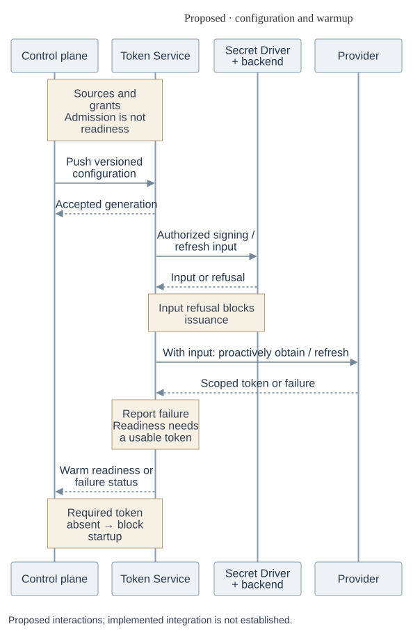
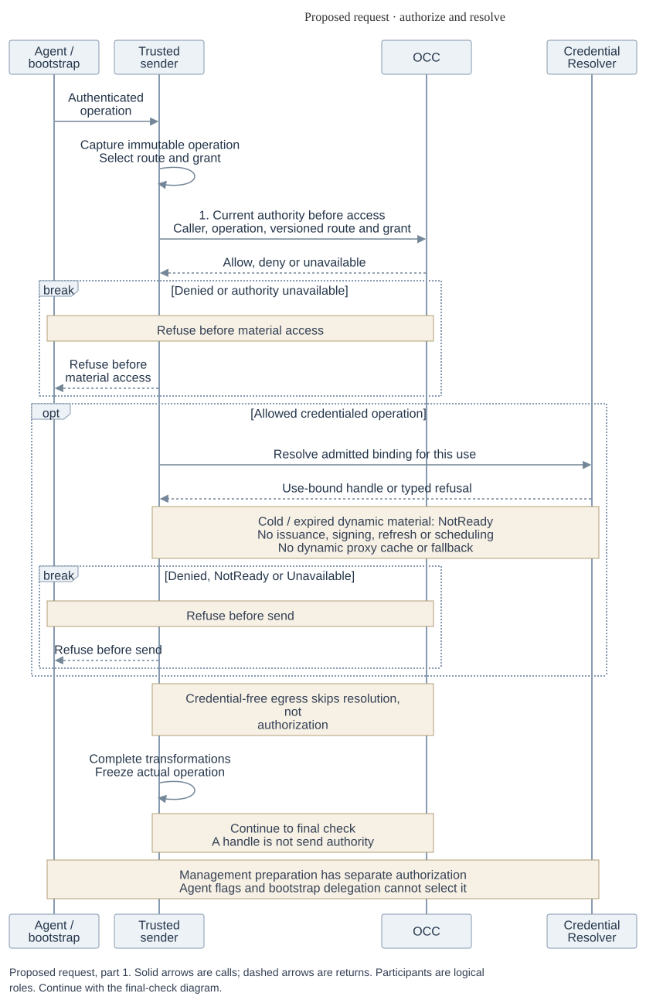
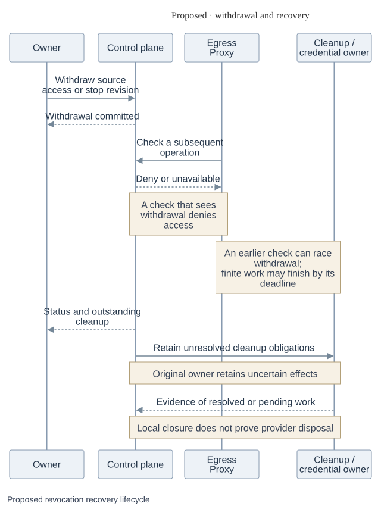

# Proposed credential lifecycle

These phases expand the [RFC](index.md). They describe proposed responsibilities,
not selected wire APIs, physical processes, or qualified runtime behavior.

## 1. Configure and warm

_Proposed phase. [Editable source](assets/configuration-warmup.mmd)._

An authorized owner configures sources and Agent bindings. OCC admits the
configuration and gives Token Service the approved dynamic grants. The service
obtains static signing or refresh inputs and prepares tokens in the background.
Accepted configuration is not warm readiness. A required token that does not
become ready within the configured bound blocks startup and reports status.
GitHub App keys, signed App JWTs, and installation tokens have distinct roles.

## 2. Prepare the optional repository

_Proposed phase; dashed edges show proposed interactions.
[Editable source](assets/clone-startup.mmd)._

Trusted bootstrap receives authority limited to the Agent execution and
configured repository. Each clone operation goes through the proxy and OCC.
Compute starts the Agent only after observed successful preparation. Failed or
uncertain clone blocks startup by default; a custom opt-out changes the clone
gate, not authorization. Bootstrap and Compute retain cleanup of partial work.

## 3. Resolve and forward

_Proposed credentialed request. [Editable source](assets/request-caching.mmd)._

The proxy captures the operation, checks its current authority, and selects one
exact binding. For static material it reads the current Secret or an eligible
cache entry. For dynamic material it reads an already-warm token; a miss does
not issue or refresh one. After awaited preparation, the proxy obtains a final
OCC check for the captured operation and then forwards. An authority partition,
denial, or unusable material refuses the operation. The provider response follows
trusted provider-specific handling. Credential-free egress skips material lookup
but still needs the final check.

## 4. Withdraw and recover

_Proposed phase. [Editable source](assets/revocation-recovery.mmd)._

A check that sees a committed withdrawal denies the removed access. A check
that races the withdrawal may still permit a send. An underway finite operation
may finish by its original deadline; cancellation is best effort. Uncertain
provider effects and cleanup remain with their original owner. Stopping or
replacing a local process does not prove an upstream effect settled. For
rotation, establish replacement adoption and settle old-key use before ordinary
retirement; emergency revocation may come first.

## Parking and forks

When an operator disables or removes an owner in OCE, confirmed loss of the
last authorized owner installs a hold and execution fence. Synchronizing
external identity-provider offboarding is later work.
Ordinary deployment, restart, repair, deletion, and garbage collection cannot
bypass the hold or remove protected data. Parking is asynchronous: report
`parking` until required stop and preservation evidence supports `parked`.
Unknown directory state is not confirmed owner loss. Platform-owned cleanup
continues for the exact accepted work even if its requester loses access; hold
release requires current authorization and a fresh execution admission.

An authorized reader may fork the declared readable artifact set from an
immutable captured version. Recheck source-read and destination-create authority
before making the fork visible. The fork has independent application data and
mutable references, a fresh stopped identity and runtime home, and no inherited
credentials, grants, approvals, or sessions. Copied schedules, hooks, and
pending work remain inert until explicitly admitted. The original remains
available for authorized read-only review. Copy-on-write, stronger stream
revocation, and deeper incident-preservation mechanisms need separate designs.
