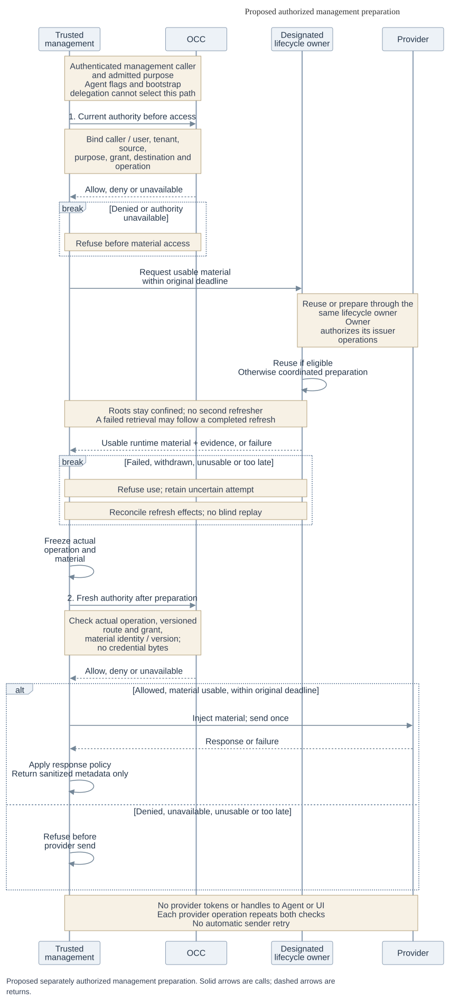
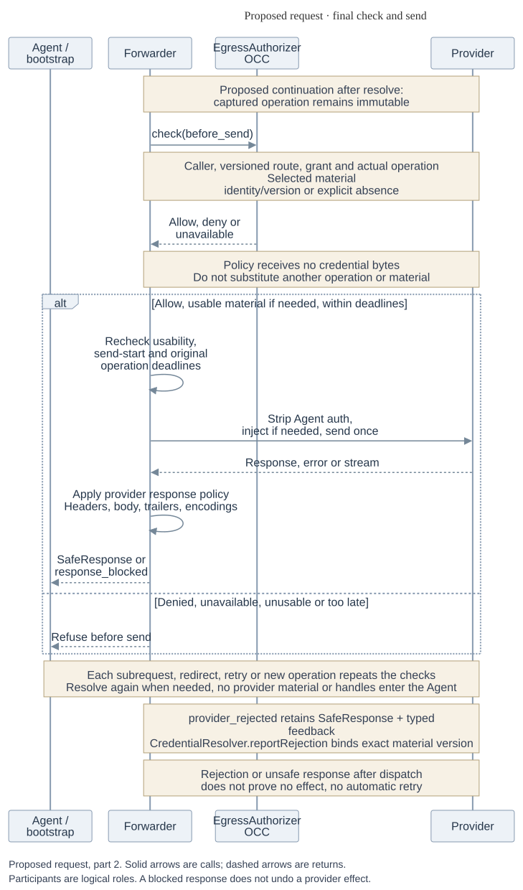

# Proposed credential lifecycle

This companion expands the [RFC](index.md), using the closed, proposed
[management](control-contracts.md) and [runtime](runtime-contracts.md) IDL.
Methods describe obligations, not implemented exports or qualified transport.
Token Service means the retained `CredentialRefreshDriver` lifecycle capability;
it adds no required service.

## 1. Configure and warm

_All interactions are proposed. Sequence arrows distinguish calls/returns, not
implementation status. [Editable source](assets/configuration-warmup.mmd)._

OCC admits configuration and grants. The designated owner prepares dynamic
material independently of requests, including while Agents are idle. Compute
observes four separate states:

| State                 | Evidence                                               |
| --------------------- | ------------------------------------------------------ |
| Configuration applied | Source configuration is accepted and applied.          |
| Material ready        | The required dynamic grant has eligible warm material. |
| Binding installed     | Sandbox confirms the exact revision attachment.        |
| Harness serving       | The Harness reports authenticated serving status.      |

Compute gates required dynamic startup on all four within a configured warm wait.
Static inputs have no warm lifecycle; authorized resolution checks their
usability. Acceptance alone cannot satisfy the dynamic gate or prove static usability.

### Lifecycle interface

Evolve `CredentialRefreshDriver` (`credential_refresh`) without importing any
`CredentialGateway` context, source-input or attachment types. It uses SourceKey,
Grant, Bounds, Command, Permit, Read, Change, Operation, CleanupPermit and Removal
from [management contracts](control-contracts.md). Prepared material is separate
from the request-bound MaterialEvidence in [runtime contracts](runtime-contracts.md).

| Shape             | Required fields and semantics                                                                                                                                                                                                                                                                                                                                                                             |
| ----------------- | --------------------------------------------------------------------------------------------------------------------------------------------------------------------------------------------------------------------------------------------------------------------------------------------------------------------------------------------------------------------------------------------------------- |
| `WarmKey`         | `{source: SourceKey, grant: Grant, grantHash: SHA-256, isolationId: Id}`. Exact normalized admitted scope, never source-only caching.                                                                                                                                                                                                                                                                     |
| `Family`          | `{scope: Scope, familyId: Id, generation: positive integer, owner: Ref, ownerEpoch: positive integer}`. Canonical input family shared across all grants consuming that input. OCC admits one owner; its durable store fences epochs.                                                                                                                                                                      |
| `LifecycleConfig` | `{source: Source, family: Family, warmKeys: WarmKey[], renewBeforeMs: positive integer, minValidityMs: positive integer, issuer: Ref, inputAuthority: Permit}`. Source's roots are delivered only to its admitted owner/issuer.                                                                                                                                                                           |
| `LifecycleStatus` | family, WarmKey, `configuredGeneration: integer\|none`, `committed: CommittedDynamic\|none`, `readiness: ready\|cold\|expired\|insufficient_validity\|withheld`, `activity: idle\|preparing\|refreshing\|uncertain\|reauthorization_required\|removing`, `attempt: Operation\|none`, `nextRenewalAt: timestamp\|none`, `error: Error\|none`, `recovery: none\|reconcile\|reauthorize\|fix_configuration`. |
| `Preparation`     | `{target: WarmKey, family: Family, mode: ensure_ready\|rotate, minRemainingValidityMs: nonnegative integer, authorization: Permit}`. Permit binds management caller, initiating user, source/grant, purpose, destination and original deadline.                                                                                                                                                           |

`CommittedDynamic` is `{target: WarmKey, family: Family, materialId: Id,
materialVersion: string, preparationAttemptId: Id, actualGrant: Grant,
providerExpiresAt: UTC timestamp}`. It contains no request, execution or binding
handle. The same admitted warm entry may serve distinct authorized bindings;
preparation and readiness do not establish permission to use it.

`CredentialRefreshDriver` methods are required for a dynamic source:

| Method and caller                                                                               | Result/semantics                                                                                                                                                                           |
| ----------------------------------------------------------------------------------------------- | ------------------------------------------------------------------------------------------------------------------------------------------------------------------------------------------ |
| OCC `configureRefresh(config: LifecycleConfig, command: Command)`                               | `Change<LifecycleStatus[]>`; accepts configuration and authorizes independent warming, not readiness. Reauthorization changes family generation/input authority; routine renewal does not. |
| Authorized management `prepare(request: Preparation, command: Command)`                         | `Change<LifecycleStatus>`; ensure-ready may reuse eligible committed material; rotate requests one owned refresh. Neither implies issuer revocation of the old token.                      |
| OCC/Compute `refreshStatus(target: WarmKey, bounds: Bounds)`                                    | `Read<LifecycleStatus>`; readiness evaluated for admitted minimum validity at observation time.                                                                                            |
| OCC cleanup `removeRefresh(family: Family, cleanup: CleanupPermit, command: Command)`           | `Change<Removal>`; stop new preparation, settle attempts and dispose/revoke owned artifacts as supported. Preserve uncertain cleanup.                                                      |
| OCC reconciler `inspect(operationId, bounds)` / `reconcile(operationId, cleanupPermit, bounds)` | `Read<Operation>` / `Change<Operation>` for the exact accepted attempt, as in management contracts. Family status alone cannot settle it.                                                  |

Known failures after acceptance return `failed` with the exact operation, safe
error and cleanup obligations; pending work and unknown effects retain distinct
results. Partial provider/profile creation and late issuer candidates stay owned
until settled. Failure does not imply rollback or permission to repeat issuance.

The same owner exposes the internal read-only facet
`WarmCredentialReader.readWarm({target: WarmKey, authorization: AccessPermit, minRemainingValidityMs}, bounds)`
to the Resolver. It returns `warm(candidate: trusted custody handle, evidence: CommittedDynamic)`
or [Refusal](runtime-contracts.md#forwarding-sequence-and-results). The handle is
bound to the operation/Resolver and expires within its Bounds. Resolver verifies
WarmKey and current binding, then adds the request binding and clamped usability
to produce MaterialEvidence and the sender's single-use MaterialHandle. Read performs no issuance, signing,
refresh, scheduling or refresh-capable retrieval.

### One owner and durable attempts

Retire a shared family only after all admitted source/grant dependencies are
released. Otherwise `removeRefresh` returns `references_remaining`; removing one
source must not destroy another source's canonical input or usable material.

Warm-key isolation does not lock a rotating family: two grants can share one
input. The owner:

1. Serializes **family-wide** consumption and fences the exact epoch/attempt.
2. Durably records the attempt and uncertainty marker before effects, then calls
   `CredentialIssuer.issue`.
3. Validates returned scope and expiry, and durably commits the replacement input
   and runtime candidate before readiness.
4. Publishes only under the current fence; retains late results for cleanup.

An interrupted exchange remains uncertain until provider-supported inspection
settles it or explicit reauthorization establishes new input. Timeout, process
replacement and lease/lock loss do not authorize blind replay. Once replacement
input is canonical, rereading a bootstrap Secret cannot overwrite it. Custody
transfer from native Harness refresh state must stop the previous consumer first.

Readiness remains true for eligible old committed material during ordinary
refresh; activity is separate. Routine renewal must not restart the proxy/Agent
or periodically interrupt use. Exceptional reauthorization may interrupt only
the affected credential, fail closed and expose recovery status. Planned hot
cutover remains later work.

### Management preparation and retrieval

_All interactions are proposed; arrows distinguish calls/returns. Management can
prepare through the one owner, then uses the common Forwarder.
[Editable source](assets/management-preparation.mmd)._

The OCC configuration/discovery service:

1. Authenticates and authorizes the exact caller/user, source, purpose, grant
   and destination before any access, then may call `prepare`.
2. Captures the business operation and calls `forward` after preparation. Both
   fresh checks and selected-material evidence precede provider I/O.
3. Returns sanitized metadata. Runtime bytes stay in trusted custody; responses
   never contain roots or tokens.

Issuer calls are independently owner-authorized. Agent and bootstrap callers
cannot obtain preparation through an `allowRefresh` flag.

At pinned [OpenShell #4357](https://github.com/NVIDIA/OpenShell/blob/4c1b16a4a104581fb0afe8675feff34f00cc2ca8/crates/openshell-server/src/grpc/provider_credentials.rs#L142-L386),
operator `GetProviderCredentials` may refresh to satisfy remaining lifetime and
can fail after refresh takes effect ([PR #4357](https://github.com/NVIDIA/OpenShell/pull/4357)).
The inspected [OCE #1785](https://github.com/openclaw/openclaw-enterprise/pull/1785)
[`withSourceToken`](https://github.com/openclaw/openclaw-enterprise/blob/dd1ac0ca8ec68c004cbc3c0049265d1e5df4a915/apps/controller/src/drivers/credential-gateway/openshell.ts#L657-L678)
uses that channel. Its proposed successor is the trusted OCC management flow,
not Agent/bootstrap `readWarm`. Checking readiness before calling a method that
can mint does not make that method warm-only.

### Live Secret cutover

Static live adoption is selected. The current
[workflow](../../../docs/reference/credential-sources.md#update-a-source) copies
values on update and requires redeployment. Proposed admission permits continuing
reads of a live SecretRef; its writer can change consumed material without
readmission. Each operation still needs current authority. Value changes preserve
source generation; reference/policy changes require admission. Failed changes
preserve the previous configuration.

| Policy                 | Default and behavior                                                                                                                                                                               |
| ---------------------- | -------------------------------------------------------------------------------------------------------------------------------------------------------------------------------------------------- |
| Freshness              | Ten minutes, configurable per source. After that, attempt a live read.                                                                                                                             |
| Eligible stale age     | **Four hours total**, configurable per source, and only for positively classified transport, timeout or throttling errors. A 09:00 observation is fresh until 09:10 and eligible only until 13:00. |
| Fail closed            | Cold, denied, revoked, missing, unknown-error and unavailable-authority paths do not use fallback. Failed reads and lower-cache hits never reset authoritative age.                                |
| Zero retention         | Disables caching and fallback at every serving layer. The normalized cache is `none` or positive bounded durations; either public zero duration selects `none`.                                    |
| Zero request-age limit | Forces an authoritative read. Fresh material remains usable for that request within its original deadline and provider/Secret expiry; zero does not make it immediately expired.                   |

Recheck usability at dispatch.

[Secret read results](runtime-contracts.md#versioned-secret-access) define version
and age evidence. Migration maps gateway copies/attachments to admitted live
references and exposes adoption by serving compositions. Validate replacement
attachments before stopping a working Agent; storage update alone does not prove
universal adoption or authorize old-key retirement. Accepted cleanup survives
source-use permission loss. Running-revision cutover still needs qualification.

## 2. Prepare the optional repository

_All edges are proposed. Bootstrap has execution/repository delegation, no
management preparation authority. [Editable source](assets/clone-startup.mmd)._

1. OCC admits repository IDs/permissions and authentic URL mapping. Repositories
   remain optional and first-class; Repo retains discovery, profiles, grants,
   sessions, deadlines and existing cleanup.
2. The lifecycle owner prepares the exact WarmKey in the background. Compute
   observes `refreshStatus` within the startup bound and the exact installation
   receipt; expiry requires rechecking, not a remembered ready boolean.
3. Compute obtains an OCC Permit for executor, Execution, repositoryId, clone
   operation, source/grant, audience and original deadline. Trusted bootstrap
   `capture`/`forward` checks every Git HTTP operation; it need not use the Agent's
   own proxy. No request-time issuance or Agent-visible Git credentials.
4. Bootstrap returns authenticated completion to Compute: execution, repositoryId,
   admitted requested Git ref (or none for the repository default), observed commit ID (or none), attemptId,
   workspace Ref, deadline, `outcome: succeeded|failed|uncertain`, and
   `cleanup: none|required|complete`. Only observed success satisfies the default
   clone gate. Failure/uncertainty blocks startup unless explicitly configured to
   opt out of that gate; the opt-out grants no extra authority.

Compute/bootstrap owns partial-workspace cleanup and exact-attempt reconciliation;
unknown clone effects are not blindly replayed. Revision-selection UX is later
work. Current Repo-plus-Sandbox guards stay until actual integration is qualified.
Owners need provisioning/credential failure status; operators need refresh/expiry
visibility. Alert channels and thresholds remain implementation choices.

### GitHub issuer bridge

Prefer investigating OpenShell scheduling with the
[CredentialIssuer](runtime-contracts.md#provider-semantics-and-issuer-boundary)
hook: OCE authenticates the owner/epoch/attempt, maps the admitted repository grant,
keeps signing custody, exchanges an App JWT and validates the actual returned
permissions/repositories and expiry. Provider-required baseline permissions are
normalized explicitly. Issuer returns only a trusted runtime candidate; it does
not schedule a second loop.

OpenShell's inspected OAuth path accepts a configured endpoint but its response
parser uses relative expiry and a fallback when expiry is absent
([source](https://github.com/NVIDIA/OpenShell/blob/4c1b16a4a104581fb0afe8675feff34f00cc2ca8/crates/openshell-server/src/provider_refresh.rs#L1966-L1983)).
A conforming bridge needs authenticated grant correlation, material identity and
trustworthy absolute expiry; fallback expiry is not evidence. Logical hook fields
are specified; physical encoding and transport remain open. An OCE-owned lifecycle
behind the same contracts is the alternative. Select one owner, never both.

## 3. Resolve and forward

_All interactions are proposed; arrows distinguish calls/returns.
[Editable source](assets/request-caching.mmd)._

_Continuation of the same proposed request, including material absence.
[Editable source](assets/request-forwarding.mmd)._

_All edges are proposed. Dynamic reuse remains behind Resolver; no proxy fallback
or stale grace. [Editable source](assets/credential-selection.mmd)._

The [runtime contract](runtime-contracts.md#two-policy-checks-and-common-resolution)
owns exact capture/check/resolve/forward fields, typed refusals, material evidence,
response protection and credential-free behavior. Cold dynamic lookup cannot
start work. Eligible committed material can survive issuer outage; unavailable
Resolver or current authority refuses use. An old ready observation is not
permission to skip either check.

## 4. Withdraw and recover

_All interactions are proposed; arrows distinguish calls/returns. Owners retain
attempts after process replacement. [Editable source](assets/revocation-recovery.mmd)._

1. OCC commits logical denial and durable withdrawal intent.
2. Egress `withdrawBinding` owns detachment; Sandbox reports enforcement evidence.
3. Retain revision-specific suppression and late-create rechecks. An earlier
   absence observation cannot erase a tombstone while an attachment may arrive.

Logical denial, detached binding, removed source and issuer revocation are
distinct results. Neither detach nor removal recalls bearer material or cancels
sent work.

`reportRejection` carries authenticated SendReceipt, source/grant generations and
exact material version. The owner may recover in the background; stale rejection
of N cannot invalidate N+1. The sender returns the provider failure through
SafeResponse, unchanged where policy permits or redacted/refused where required,
without retry.

Unknown send/refresh/clone effects preserve owner, deadline, attempt and cleanup
through restart, including late outcomes. Use inspect/reconcile or explicit
reauthorization, never blind replay. Restored configuration is not warm readiness.
Ordinary retirement waits for replacement visibility/adoption and old in-flight
use; emergency revocation may precede those observations.

## Parking and forks

[Security](security.md#withdrawal-and-owner-loss) retains confirmed last-owner
hold, asynchronous parking and data preservation; remaining team owners keep
working. Unknown directory state is not confirmed owner loss. [Authorized deep
forks](security.md#authorized-forks) receive fresh stopped identities, independent data and no inherited
credentials, grants, approvals or sessions. External IdP synchronization,
copy-on-write and stronger stream revocation remain separate work.

## Earlier Token Service proposal

[PR #924](https://github.com/openclaw/openclaw-enterprise/pull/924) supplied issuer
metadata, normalized grants, scope/expiry validation, distinct issuer/consumer
duties, discovery, uncertainty and cleanup. Retain those requirements with
background preparation and warm-only requests, separately authorized management,
central or delegated custody and durable rotating state. Do not restore
demand-driven Agent issuance, memory-only rotating inputs or an indefinite Agent
bearer. [#1691](https://github.com/openclaw/openclaw-enterprise/pull/1691) describes
narrower refresh composition. Standalone packaging and Git-hook/`pushRefAllowlist`
removal remain historical/separate work; neither proposal is thereby accepted.
The [original design](https://github.com/openclaw/openclaw-enterprise/tree/55e261623e6ba879eab1e2d27daa309d571a994a/specs/rfcs/0056-token-service)
preserves its rationale.

## Implementation discovery and qualification

[The migration inventory](control-contracts.md#complete-legacy-disposition) covers
all legacy methods and consumers. Implement admission/attempt state, migrate source
and egress management, connect runtime checks/Resolver, qualify static and one
dynamic path, then integrate Harness/optional clone before retiring old exports,
composition and persistence coupling.

| Area               | Required evidence                                                                                                                                                                                                                                                                                                                                                         |
| ------------------ | ------------------------------------------------------------------------------------------------------------------------------------------------------------------------------------------------------------------------------------------------------------------------------------------------------------------------------------------------------------------------- |
| OpenShell join     | Versioned Egress/Sandbox receipt, authenticated capture, final OCC check after material selection, actual warm-only read, response policy and no bypass. Current adapters do not satisfy the complete contract.                                                                                                                                                           |
| Lifecycle          | #4357's [shared path](https://github.com/NVIDIA/OpenShell/blob/4c1b16a4a104581fb0afe8675feff34f00cc2ca8/crates/openshell-server/src/provider_refresh.rs#L984-L1357) coordinates refresh and records uncertainty before issuance/commit. Prove family-wide fencing, durable replacement, attempt-correlated outcomes and continued old-token reads during routine renewal. |
| Static and custody | Versioned Secret reads, trustworthy age/errors across caches, zero retention, live adoption and exact permitted consumers.                                                                                                                                                                                                                                                |
| Providers          | Real scoped GitHub, safe response forms, bootstrap completion/cleanup, and Codex account integration. The pinned [Codex HTTP/SSE fallback](https://github.com/openai/codex/blob/a956835d020762cb2b570053af06f643a11c0ecc/codex-rs/core/src/client.rs#L1918-L1925) is source evidence, not composed protocol qualification.                                                |
| Composition        | Qualify each protected capability against the actual versions, configuration, provider/protocol slice and custody; self-declared flags are insufficient. Preserve initial Kubernetes/same-Backend/Repo guards until replacements work. Additional loading, independent backends, strong local development, DNS, packaging and scale/HA require follow-up qualification.   |

At the inspected #1749 revision, [installed package loading](https://github.com/openclaw/openclaw-enterprise/blob/1c6ac12fb7a68213469ff9f43fe5e93588410d2c/apps/controller/src/composition/driver-packages.ts)
supports configuration, IAM, Compute and Sandbox Drivers. Framework registration
does not make credential Drivers or arbitrary Backends installation-loadable.
The [shared refresh coordination](https://github.com/NVIDIA/OpenShell/blob/4c1b16a4a104581fb0afe8675feff34f00cc2ca8/crates/openshell-server/src/provider_refresh.rs#L984-L1174)
uses local/distributed locks, a recheck and uncertainty marker; installed
concurrency, restart, partitions and recovery remain unproved by source alone.

Earlier [#1559](https://github.com/openclaw/openclaw-enterprise/pull/1559) proposed
trusted discovery. Neither that proposal nor the refresh-capable #1785 callback
qualifies request-path resolution. Dedicated Codex normally uses a
[Responses WebSocket](../../../docs/reference/harness-execution.md); the pinned
HTTP/SSE fallback above applies to an initial `426` handshake and still needs
connected OCE/OpenShell qualification.

The Egress Proxy MVP qualifies its declared bounded provider slice. OCE 1.0 also
requires static inference, GitHub preclone, Codex OAuth and custom dynamic paths.
Rotating OAuth may follow MVP; any slice using rotating inputs must already meet
its concurrency/restart/recovery requirements. Source, fixture, installed-runtime
and live-provider evidence support distinct claims; no-op CI and deployment
acceptance prove neither enforcement nor readiness.

Related: [security validation](security.md#required-validation),
[Credential Gateway RFC](../0016-sandbox-credential-injection.md) and
[Agent egress RFC](../0017-agent-egress-0x/index.md).
