# Credential Gateway and Token Service

**ID:** RFC-0080

**Created:** 2026-10-06

## Proposal

Give Agents access to providers without putting provider credentials in their
workloads. Route all Agent egress through a pluggable **Credential Gateway**.
The Gateway checks each operation against the control plane, then obtains and
injects authorized credentials. A **Secret Driver** supplies static material;
a **Token Service** prepares and refreshes dynamic credentials in the
background. OpenShell is a candidate Gateway implementation.

This is a working proposal for team discussion. It does not claim the
components are integrated or deployed today.



_Dashed edges represent proposed relationships. Placement is open. Each request
needs an authorization decision, including a static-cache hit; denial or an
unavailable decision blocks forwarding. The Token Service refreshes in the
background. See the [lifecycle phases](lifecycle.md) for request and recovery
flows._

The Agent's OpenClaw Gateway is a separate component. Prefer one shared
Credential Gateway and, if feasible, a control-plane traffic processor with
central credential custody. OpenShell currently coordinates per-sandbox
supervisors. If V1 requires distributed processing, an isolated trusted
supervisor outside the workload may hold scoped credentials in memory.
Physical placement and transport remain open.

OCE's existing Credential Gateway Driver manages source registration and
revision attachment. This proposal adds per-operation authorization and
egress; whether those operations extend the Driver or use a cooperating
interface remains open.

**In scope:** GitHub App, Codex OAuth and custom dynamic credentials; static
key rotation; Agent-scoped authorization; optional repository bootstrap; and
basic owner and operator status. Horizontal Gateway HA, mTLS identity,
Gateway caching of dynamic tokens, repository revision/setup and detailed
alerting are later work.

## Credential Gateway

The Gateway authenticates the current execution, asks the control plane to
authorize the operation, and forwards only if the decision and any required
credential are usable. The Agent presents an identity bearer for its existing,
immutable Namespace-scoped service principal; that bearer is distinct from
provider credentials.

```ts
// Conceptual contracts, not selected APIs, wire types or placement.
type Use = {
  identity: AgentAndCurrentExecution; // or delegated bootstrap
  destination: DestinationAndOperation;
  credential?: SourceAndScope; // absent for credential-free egress
};
declare function forward(use: Use): Response | Refused;
```

- Check current control-plane authority for **every operation**, including
  reused connections and cache hits. A denial, ambiguous authority or
  unavailable decision blocks new requests. The extra latency and
  availability dependency are accepted for V1.
- Enforce the boundary for all egress, including child processes and alternate
  network paths. Unsupported protocols must not bypass it. UDP/QUIC may be
  denied for MVP; supporting them is desirable if practical. DNS requires its
  own treatment.
- Bind the authorized destination to the actual connection and protocol
  authority, including DNS, IP, port, TLS, HTTP authority and redirects as
  applicable. Strip Agent authentication before forwarding. Protect secrets
  from workload files, logs and errors; an allowed provider may reflect a
  credential in its response, so response controls need design.
- Authenticate trusted service callers and keep management and
  credential-vending interfaces out of the Agent workload; custom adapters
  must preserve this boundary. A copied bearer or a first-connection check
  alone does not prove current execution authority.

**Discuss with Gateway, OpenShell, IAM and security owners:**

1. Which V1 placement can satisfy the same Gateway contract: a shared
   processor or OpenShell's per-sandbox supervisors? What trusted transport and
   secret custody does each require?
2. Which interface owns forwarding, and how does it compose with the existing
   Driver's source and revision lifecycle?
3. How do issuer, audience, lifetime, delivery and replay protection bind the
   bearer to the current execution and delegated bootstrap, including
   non-HTTP operations?
4. Which protocols and DNS paths can be enforced, and what is the simplest
   reliable treatment of already-open requests and streams after revocation?

See the existing [Credential Gateway Driver RFC](../39-sandbox-credential-injection.md)
and [Agent egress RFC](../40-agent-egress-0x/index.md) for related decisions.

## Secret Driver

The trusted Gateway reads static material through a Secret Driver-backed
access path. The Token Service should also use this interface for long-lived
inputs where practical. The existing Driver is an in-process library; a
remote value-access or sign-only service is not established.

```ts
declare function readStatic(
  consumer: TrustedConsumer,
  source: AuthorizedSource,
): StaticMaterial | Refused;
```

The Gateway may cache static material, scoped to its source, generation and
authorized use. Provisional per-source defaults are **10 minutes fresh** and,
only on an eligible temporary Secret-store error, **four hours maximum total
age** for a retained value. A zero cache period disables retention and
fallback. A cold miss, missing material, unknown error, explicit denial or
known revocation fails closed. A failed read never resets the age, and
authorization is still checked on every use.

Do not enable stale fallback until the implementation distinguishes eligible
transient failures from denial and has trustworthy age evidence. The current
Kubernetes Driver can report authorization failures and generic backend
failures under the same unavailable error. A lower cache may also return a
successful but older value. [Rotation and restart](#appendix-failure-recovery-and-migration)
need separate adoption evidence.

**Discuss with Secret and Gateway owners:** What trusted access path and
signing custody should we use? Which errors qualify for fallback, what
establishes value age and version, and how do invalidation and restart work?
See the existing [Secret Driver contract](../../../docs/reference/drivers/secret.md)
and [Kubernetes Secret Driver](../../../docs/reference/drivers/kubernetes-secret.md).

## Token Service

The control plane pushes configuration to Token Service. The service
proactively obtains and refreshes dynamic credentials and reports readiness.
For each relevant operation, the Gateway requests an already-warm credential;
lookup never triggers issuance or refresh. V1 has no credential push to the
Gateway and no Gateway dynamic-token cache.

```ts
declare function configure(source: SourceConfiguration, generation: Generation): Accepted | Refused;
declare function lookupWarm(gateway: TrustedGateway, use: AuthorizedUse): ValidWarmToken | Refused;
```

- Authenticate the Gateway and authorize the Agent or delegated bootstrap
  against the accepted source generation and applicable provider account,
  repository, permissions and operation. Sharing a source does not share
  authorization.
- The control plane is the authority for each decision. Token Service must
  verify current authority for the bound use, whether by checking the control
  plane or validating its decision. An unverifiable decision fails closed;
  the proof and transport remain open.
- Refuse missing, expired, insufficiently valid, stale-generation or
  unavailable material. Configuration acceptance alone is not readiness.
  A Token Service outage blocks relevant new operations.
- Target one active refresher per grant, with durable ownership and fencing.
  Transfer Codex refresh custody deliberately: the current runtime refreshes
  its own `auth.json`. An uncertain rotating response requires provider
  reconciliation or reauthorization, not blind replay.

GitHub App signing keys, App JWTs and installation tokens are distinct; so
are OAuth refresh and access tokens. The owner sees provisioning status and
receives alerts for affected Agents. Platform operators see refresh failures
and approaching expiry, with configurable notification policy.

**Discuss with Token, Secret and operations owners:** Where do configuration
and tokens persist? How are refresher ownership, fencing and Codex custody
transferred? How does Token Service verify a bound decision? What validity
margin, bounded readiness wait and alert policy should each provider use?
The [Codex OAuth storage contract](../../../docs/reference/drivers/kubernetes-compute/codex-oauth-storage.md)
describes the current runtime-owned refresher.

## Repository and startup

Keep repositories first-class and optional for now. The common path should be
easy; custom implementations can compose the same interfaces. The existing
repository contract owns discovery, profiles, grants, sessions, deadlines and
cleanup. Removing the Repo Driver later requires explicit new owners for those
responsibilities.

1. The operator prepares the Namespace, Drivers, backends and provider
   configuration. The owner registers a source with
   `POST /namespaces/:namespaceId/credential-sources`, requiring Namespace
   `credential_source:create` and `secret:operate` on each Secret. The response
   returns a source reference, not the value.
2. Create or update the Agent and bind the source using `harnessAuth`. The
   response supplies its immutable `servicePrincipalId`. Grant both the caller
   and that principal `operate` on the exact source; the Agent needs no
   underlying Secret grant. Deploy and worker dispatch check both grants.
3. Call `POST /namespaces/:namespaceId/agents/:agentId/deploy`. A `202` admits
   and queues a revision; it is not readiness. Poll deployment status with
   exact AgentRevision `read`. Guided provisioning does not currently accept
   credential sources.
4. Wait a bounded time for required dynamic credentials to warm. If a
   repository is configured, trusted bootstrap clones through the Gateway
   under scoped Agent/revision authority before the Agent starts.
5. Failed or uncertain clone blocks startup by default. A custom opt-out may
   change the clone gate but cannot bypass authorization. Compute/bootstrap
   owns completion evidence and partial-workspace cleanup.

For example, bootstrap uses an authorized warm GitHub installation token to
clone. A later inference request gets a separate authorization and static-key
lookup.

**Discuss with repository and Compute owners:** How is bootstrap delegated
and completion proven? Where do its responsibilities go if the Repo Driver
is removed? Product and IAM should also decide whether separately
authorized Agents may share a source.

See the [repository credentials contract](../../../docs/reference/repository-credentials.md)
and [credential source contract](../../../docs/reference/credential-sources.md)
for current registration and grant requirements.

## Delivery and evidence

The proposed joins require work. OCE has Agent service principals, but
[workload-token verification and identity exchange](../../../docs/reference/authorization.md)
remain deferred. Current [credential source registration](../../../docs/reference/credential-sources.md)
supports a static OpenAI source for dedicated Codex; OpenShell is not yet a
supported production Agent path. The proposed Gateway rotation and dynamic
source paths are not established.

Existing repository credential exchange is not the proposed warm-only Token
Service. The current Repo Driver does not clone, and Installation and Compute
reject repository credentials with Sandbox.

Before calling the design implemented, verify:

| Area       | Required evidence                                                                                                                                                     |
| ---------- | --------------------------------------------------------------------------------------------------------------------------------------------------------------------- |
| End-to-end | Installed runtime: optional GitHub clone before startup, static inference, Codex OAuth and a custom dynamic type. Include two-Agent and cross-Namespace denial.       |
| Boundary   | No direct or alternate egress bypass; current execution and per-operation checks; destination and protocol handling; no unintended secret exposure.                   |
| Lifecycle  | Bounded readiness; rotation, cache limits and revocation; refresh while idle and no issuance on lookup; outage and uncertain-refresh recovery; partial-clone cleanup. |

Keep source, integrated runtime and live-provider evidence distinct. The
[Credential Gateway Driver RFC](../39-sandbox-credential-injection.md) and
[Token Service proposal](https://github.com/openclaw/openclaw-enterprise/pull/924)
are related prior proposals, not approval of this design.

## Appendix: failure, recovery and migration

- **Static rotation:** activate the replacement, update storage and establish
  its visibility and adoption by every serving processor, and resolve old-key
  in-flight uses, before ordinary retirement. A successful read or readiness
  alone does not prove adoption.
  Emergency revocation may precede adoption.
- **Withdrawal and streams:** deny newly unauthorized operations. Treatment
  of active streams remains open. Even a confirmed `revoked` outcome does not
  erase credentials already in running processes, undo forwarded effects or
  prove provider disposal; retain cleanup obligations.
- **Restart:** Gateway local cache is lost; a cold Secret read has no stale
  fallback. Restored Token Service configuration is not warm readiness.
- **Uncertain effects:** retain the original owner, deadline and cleanup.
  Do not replay a possibly dispatched provider write, refresh or partial
  clone because of a timeout, local closure or replacement. Reconcile with
  the provider or reauthorize where needed. Local CAS cannot atomically
  commit an external provider effect.
- **Broker replacement:** a surviving broker may retain its sessions; a
  replacement loses process-local tokens and action inventory. Only the
  original broker records its disposal observation. A receipt does not prove
  that an unknown provider effect settled.
- **Partial clone:** keep untrusted partial work isolated until bootstrap or
  Compute cleans it up or safely retries. Do not put provider-credential-bearing
  Git configuration or helpers in Agent-visible files.
