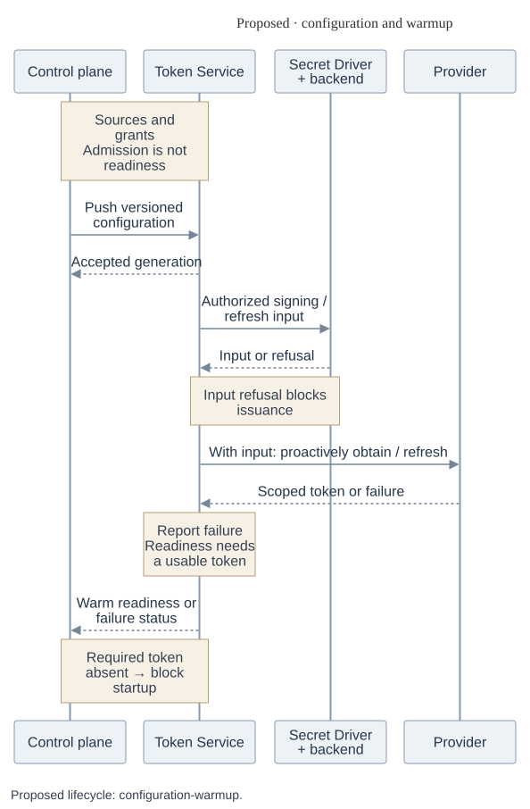
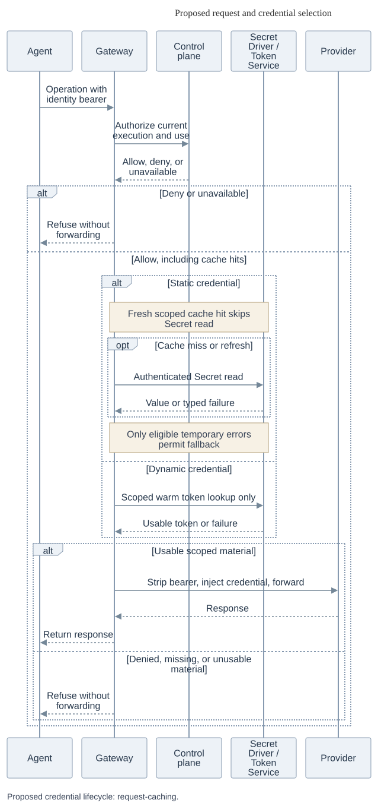
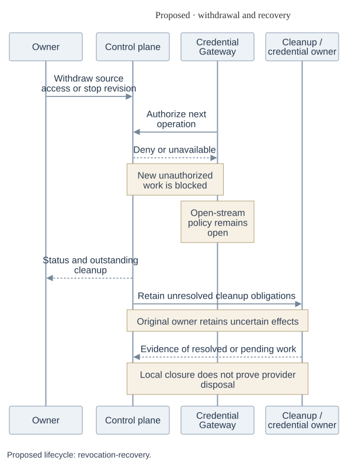

# Proposed credential lifecycle

This view separates the main journey from four supporting phases. It describes a proposal, not implemented or qualified behavior. Boxes and lifelines name logical responsibilities, not a physical topology or selected wire interfaces. Provider credentials belong at the trusted gateway boundary, outside the Agent workload. The Agent bearer identifies the caller and is distinct from those credentials.

## Main RFC overview

_Proposed overview — dashed edges show proposed relationships. Placement is open._ [Editable source](assets/overview.mmd).

The same gateway path serves trusted bootstrap clone operations before Agent startup and Agent inference after startup. The gateway synchronously asks the control plane about **every operation**, including static-cache hits, and forwards only after an allow decision and usable material. Denial, ambiguous authority or unavailable authorization stops forwarding. A fresh static-cache hit does not need another Secret Driver read. Dynamic gateway lookups retrieve only already-warm tokens; Token Service obtains and refreshes them in the background from configured inputs. The overview shows logical responsibilities and does not choose per-Agent or per-sandbox placement, transport or wire protocol.

## Phase 1 — Configuration and warmup

_Proposed phase 1 — time flows downward, with ordinary request and reply arrows._ [Editable source](assets/configuration-warmup.mmd).

The operator prepares the Namespace, Drivers, Backends, networking and provider configuration. The caller registers a source, obtains its reference, grants exact source use to the Agent principal and deploys. Registration checks Namespace `credential_source:create` and `secret:operate` on referenced Secrets. Deployment and dispatch check both caller and Agent source `operate`. The Agent receives no underlying Secret grant.

Accepted configuration is not warm readiness. Required material must become usable within a bounded wait whose duration remains open. Input refusal or provider failure belongs to Token Service; missing required readiness blocks startup and produces owner/operator status. Background refresh continues without request traffic. A refresh failure can leave an existing token usable only while sufficiently valid and currently authorized.

GitHub App signing keys, signed App JWTs and installation tokens are distinct. OAuth refresh and access tokens are also distinct. Initial support retains GitHub App, Codex OAuth and custom types. Secret Driver value access is an in-process capability, not an already-selected remote API or sign-only service. Access mechanism, signing custody, persistence and provider-specific validity margins remain open.

## Phase 2 — Optional clone and startup

_Proposed phase 2 — dashed edges denote proposed paths._ [Editable source](assets/clone-startup.mmd).

Required warm readiness precedes this phase. Without a repository, there is no clone gate. Otherwise, trusted bootstrap receives authority limited to the Agent, revision, repository, profile, allowed Git operations and original deadline. **Each bootstrap operation** goes through the gateway's synchronous control-plane decision, including operations on reused connections. An allow decision precedes the scoped Token Service lookup and forwarding. Denial or authorization unavailability makes the gateway refuse; denied, missing, stale-generation, expired, insufficiently valid or unavailable warm material also stops forwarding without issuance.

Compute starts the Agent after observed successful clone completion and other startup gates. Failed or uncertain completion blocks startup by default. Compute/bootstrap owns isolated partial work, cancellation, cleanup and safe retry. An explicit custom opt-out changes the clone startup gate only, never credential authorization. Repository contents and workspace state are untrusted; provider-credential-bearing Git configuration and helpers must not enter Agent-visible files.

## Phase 3 — Requests and credential caching

_Proposed phase 3 — time flows downward; arrows show requests and replies._ [Editable source](assets/request-caching.mmd).

The control-plane decision binds the immutable Namespace-scoped Agent principal to the current revision/execution, destination, operation and credential source. A bearer alone does not prove that execution. Issuer, audience, delivery, lifetime, replay containment and non-HTTP carriage still require design. Canonical destination checks must remain consistent through DNS, socket, TLS and protocol authority, including redirects and subsequent operations. Unsupported traffic must not bypass enforcement.

Static credentials use a scoped gateway cache or authenticated Secret Driver/backend access on miss or refresh. A fresh cache hit need not reread the Secret Driver, but still needs the live control-plane decision. The provisional per-source freshness default is about ten minutes. Only an eligible temporary Secret-store error permits retained-value fallback, up to a provisional four hours **total age**, configurable per source. Zero disables caching and retained-value fallback. A failed cold read, denied or revoked material, an unknown/ineligible error, or an over-age value refuses forwarding. Failed reads never reset age. Even a fresh cache entry cannot override denial, known revocation or an unavailable control-plane decision.

Fallback requires trustworthy age/version evidence and typed failures that distinguish temporary errors from denial/revocation. Those capabilities and restart/clock semantics remain unresolved; fallback cannot safely be enabled before they exist. A successful lower-cache read is not proof of globally latest material.

Dynamic lookup authenticates the trusted gateway and authorizes Agent or delegated bootstrap use against the exact accepted configuration generation and applicable Namespace, execution, source, provider account/installation, repository, permissions, destination and operation. It neither issues nor refreshes. There is initially no gateway dynamic-token cache and no token push to the gateway. Unusable or unavailable lookup results fail before forwarding.

The gateway strips Agent authentication and injects only the scoped provider credential. Provider results return through the gateway, not through a credential delivery channel to the Agent. Response, stream, error and log controls still need design because an allowed upstream can reflect an injected secret. The drawing makes no blanket non-disclosure guarantee.

## Phase 4 — Withdrawal and recovery

_Proposed phase 4 — time flows downward, with ordinary request and reply arrows._ [Editable source](assets/revocation-recovery.mmd).

Newly unauthorized requests are denied, including cache hits and warm-token use. Treatment of already-open requests and streams remains a team decision. A confirmed `revoked` outcome means the revision's placeholders no longer resolve. It does not erase strings in running processes, undo forwarded bytes or prove provider disposal. Stop/Delete retains unresolved cleanup.

For ordinary static rotation, the credential administrator activates a replacement, updates storage, establishes backend/lower-cache visibility and may invalidate gateway caches. Every serving processor must adopt the replacement and old uses must settle before retiring the old key. Emergency provider revocation may precede adoption. Readiness or a successful read alone does not establish safe retirement.

| Failure owner                                      | Consequence and retained responsibility                                                                                                                                                                                                                                                                                                                               |
| -------------------------------------------------- | --------------------------------------------------------------------------------------------------------------------------------------------------------------------------------------------------------------------------------------------------------------------------------------------------------------------------------------------------------------------- |
| Gateway                                            | Restart loses local cache and connections. A cold read has no retained fallback; new operations still require a live authorization decision.                                                                                                                                                                                                                          |
| Token Service / credential owner                   | Restored configuration is not restored warm readiness. Transfer refresh custody deliberately, retire the old refresher and fence stale owners. A lost rotating response or write-back requires provider-supported reconciliation or reauthorization, never blind retry. Local CAS cannot atomically commit provider effects.                                          |
| Compute / bootstrap                                | Keep partial workspace and uncertain clone completion under the original recovery owner. Do not infer completion or restart possibly dispatched work automatically.                                                                                                                                                                                                   |
| Repository broker / original provider-effect owner | A worker restart may reuse a surviving broker. Broker replacement loses process-local bearer, tokens and action inventory. Missing sessions fail the revision and retain cleanup; preserve attempts, original deadlines and committed original-owner receipts within their contracts. Replacement, local closure or timeout does not settle unknown upstream effects. |

These phases retain consequences without expanding every equivalent failure into a separate branch. They do not select physical placement, active-stream behavior, new deadlines or an OAuth migration exception, and they establish no installed or live-provider guarantee.
